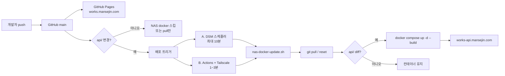

# NAS 자동 배포 시스템 이해하기 (works-site)

다른 사람에게 **「git push만 하면 NAS에 API가 반영되는 이유」**를 설명할 때 쓰는 요약 문서입니다.  
셋업 절차만 필요하면 → [`api/docs/deploy-nas-auto.md`](../api/docs/deploy-nas-auto.md)

---

## 한 줄 요약

```
개발자: git push origin main
        ↓
   ┌────┴────┐
   │         │
프론트(HTML)   API(Docker)
GitHub Pages   Synology NAS
works.mansejin.com   works-api.mansejin.com
```

- **정적 페이지** (`dddit/`, `project/` …) → GitHub Pages가 자동 배포  
- **백엔드 API** (`api/`) → NAS가 git pull 후 **필요할 때만** Docker 재빌드  

비밀키(Gemini, YouTube, 시트 OAuth 등)는 브라우저/GitHub에 두지 않고 **NAS `api/.env`에만** 둡니다.

---

## 왜 이렇게 나뉘어 있나

| | 프론트 | API |
|--|--------|-----|
| 성격 | HTML/CSS/JS 정적 파일 | Node/Python + 비밀키 + 영속 데이터 |
| 호스팅 | GitHub Pages | Synology NAS (Docker) |
| 공개 URL | `https://works.mansejin.com/...` | `https://works-api.mansejin.com` |
| 배포 트리거 | `main` push (전체) | `api/**` 변경 시 (또는 주기 pull) |

Pages만으로는 API 키를 안전하게 돌릴 수 없어서, **비밀이 필요한 일은 NAS**로 보냅니다.

---

## 전체 그림



---

## 배포 방식 2가지 (둘 다 같은 스크립트)

핵심 실행 파일은 하나: **`api/scripts/nas-docker-update.sh`**

### A. DSM 작업 스케줄러 (추천 · 가장 단순)

sgb 등 다른 NAS 서비스와 같은 패턴입니다.

1. NAS에 `works-site` 전체 `git clone` (`/volume1/docker/works-site`)
2. DSM → 작업 스케줄러 → **root**, 5~10분마다  
   `sh .../api/scripts/nas-dsm-task.sh`
3. 스케줄러가 GitHub에서 **최신 `nas-docker-update.sh`를 curl** 한 뒤 실행

```
push → (최대 10분 대기) → NAS pull → api 바뀌었으면 rebuild
```

장점: GitHub Secrets / Tailscale 없이도 동작  
단점: 반영까지 스케줄 주기만큼 지연

### B. GitHub Actions + Tailscale (빠른 반영)

`api/**` 또는 워크플로 파일이 바뀐 `main` push 시:

1. Actions가 **Tailscale**으로 NAS 사설망 접속
2. **SSH**로 NAS 접속
3. 같은 `nas-docker-update.sh`를 curl 후 `--full-build` 실행

워크플로: [`.github/workflows/deploy-nas.yml`](../.github/workflows/deploy-nas.yml)

필요 Secrets:

| Secret | 역할 |
|--------|------|
| `TAILSCALE_AUTHKEY` | Actions → NAS 네트워크 |
| `NAS_SSH_HOST` | Tailscale IP (`100.x…`) |
| `NAS_SSH_USER` / `NAS_SSH_KEY` | SSH 로그인 |
| `NAS_REPO_PATH` | 보통 `/volume1/docker/works-site` |

장점: push 후 1~3분  
단점: Secrets·Tailscale 설정 필요 (sgb와 공유 가능)

---

## `nas-docker-update.sh`가 하는 일

순서만 기억하면 됩니다.

1. **git sync** — `origin/main`(또는 `WORKS_DEPLOY_BRANCH`)으로 hard reset  
   - `.env`, `logs/` 는 지우지 않음
2. **변경 감지** — 이전 커밋 ↔ 새 커밋에 `api/` 경로 diff가 있는지 확인
3. **조건부 빌드**
   - `api/` 변경 있음 또는 `--full-build` → `docker compose up -d --build`
   - 프론트만 바뀜 → pull만 하고 컨테이너는 그대로

그래서 **HTML만 고친 push**는 Pages만 바뀌고, NAS는 무거운 rebuild를 안 합니다.

관련 래퍼:

| 파일 | 역할 |
|------|------|
| `api/scripts/nas-docker-update.sh` | 실제 pull + 조건부 rebuild |
| `api/scripts/nas-dsm-task.sh` | DSM용 (curl 최신 스크립트 + lock + 로그) |
| `.github/workflows/deploy-nas.yml` | Actions → Tailscale → SSH → 스크립트 |

---

## 런타임 연결 (배포 이후)

```
브라우저 (works.mansejin.com/dddit/...)
    │  HTTPS
    ▼
Cloudflare Tunnel  ──►  NAS Docker :8788  (works-api)
                   └──►  NAS Docker :8789  (conti WebSocket, 선택)
```

- DNS: `works-api` → Cloudflare Tunnel (프록시 ON)  
- 헬스체크: `https://works-api.mansejin.com/health`

프론트는 브라우저에 키를 안 넣고, NAS API를 호출합니다.

---

## 설명용 비유

| 현실 | 시스템 |
|------|--------|
| 가게 진열장 | GitHub Pages (누구나 보는 화면) |
| 주방 + 금고 | NAS Docker (비밀키·연산) |
| 배달 앱 알림 | DSM 스케줄 / GitHub Actions |
| 레시피 최신판 | `nas-docker-update.sh` (git pull) |
| 메뉴 바뀌면만 오븐 재가동 | `api/` diff 있을 때만 rebuild |

---

## 다른 사이트에 같은 패턴을 옮길 때 체크리스트

1. **저장소**에 백엔드 폴더 + `docker-compose` + `.env.example`
2. **NAS**에 repo 전체 clone (폴더만 복사하지 말 것 — `.git` 필요)
3. **비밀은 NAS `.env`만** (Git에 커밋 금지)
4. **배포 스크립트** = pull + “백엔드 경로 변경 시에만” rebuild
5. **트리거** 택1 또는 병행  
   - DSM 주기 실행 (쉽고 확실)  
   - Actions + Tailscale SSH (빠르고 push 연동)
6. **공개 URL**은 Cloudflare Tunnel로 HTTPS
7. 프론트는 Pages, API만 NAS — 역할을 섞지 않기

---

## 자주 묻는 말

**Q. 프론트만 고쳤는데 NAS 로그에 pull이 찍혀요?**  
A. 정상입니다. pull은 할 수 있고, `api/` diff가 없으면 docker build는 스킵합니다.

**Q. push했는데 API가 안 바뀌어요.**  
A. (1) `api/` 경로가 커밋에 포함됐는지 (2) DSM이면 스케줄 대기 (3) `api/logs/deploy.log` 확인.

**Q. `cannot access docker daemon`**  
A. DSM 작업 사용자를 **root**로, 또는 `.env`에 `WORKS_DOCKER_SUDO=1`.

**Q. sgb랑 뭐가 같아요?**  
A. 「NAS에 git 두고 스케줄/Actions로 pull + 조건부 재시작」패턴이 같습니다. 이 저장소는 그걸 `works-api`에 맞춰 둔 버전입니다.

---

## 더 읽을 곳

| 문서 | 내용 |
|------|------|
| [`api/docs/deploy-nas-auto.md`](../api/docs/deploy-nas-auto.md) | DSM / Actions **설치 절차** |
| [`api/README.md`](../api/README.md) | works-api 역할·환경변수·엔드포인트 |
| [`README.md`](../README.md) | works-site 전체·Pages 배포 |

---

*대상 저장소: [Mansejin/works-site](https://github.com/Mansejin/works-site) · 경로 기준 `/volume1/docker/works-site`*
